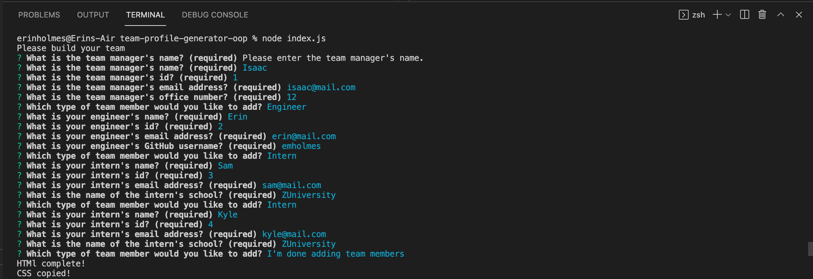
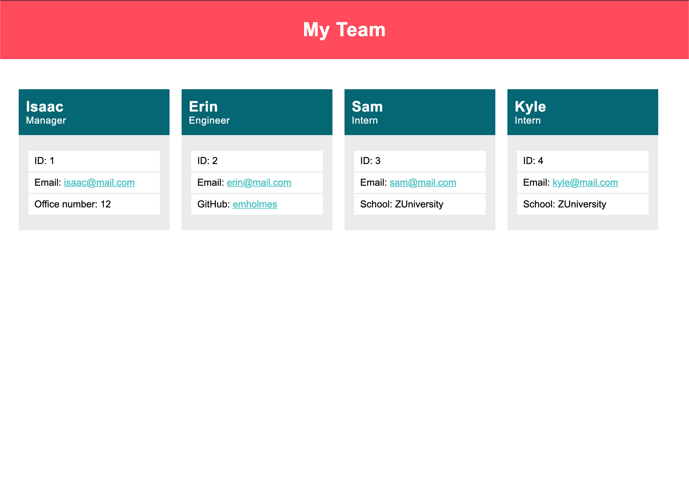

# Team Profile Generator
## Object-Oriented Programming Challenge

## Description
This repo contains code to generate a team profile page using node.js and inquirer.js to prompt the user via the command-line the team member's information. This app also contains unit tests built with Jest. Technologies used to build this app includes Node.js, Inquirer.js, Jest, HTML, and CSS. View the installation and usage sections below for more details on how to use this repo.

## Table of Contents
* [Installation](#installation)
* [Usage](#usage)
* [Tests](#tests)
* [Video Walkthrough](#video-walkthrough)
* [Questions](#questions)

## Installation
To install any necessary dependencies run the following command: 

    npm install

## Usage 
After cloning the repo to your local machine, open the package in an IDE. Make sure you have node.js and npm installed (hint: `node -v` & `npm -v`). In the package root directory, install inquirer.js (`npm install inquirer`). Once all dependencies are installed, initiate the program by running `node index.js` from the terminal in the root directory. After all questions are answered and the user is done adding team members, an index.html file and the corresponding stylesheet will be generated and added to a directory named: /dist/index.html and /dist/style.css. Open the index.html file in your browser to view the results.

## Tests
To run tests, use the following command: 

    npm run test

## Video Walkthrough
[Watch video walkthrough](https://drive.google.com/file/d/1oB34YIYzKOCTWpCsK3Cm1F1w9VTVx0te/view)

## Invoking app in the terminal: 

## Final page generated by application: 
 

## Questions
If you have any questions or feedback, create a new issue and add the label "question". 
View more of my work: [github.com/emholmes](https://github.com/emholmes).